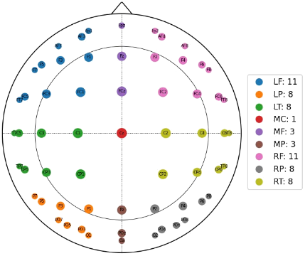
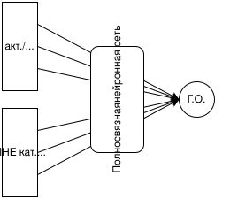
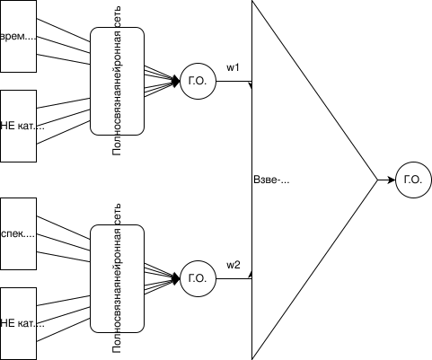

# vkr-tools

All the stuff I written for my bachelor's thesis (вкр) at Novosibirsk State University (НГУ), 2026. I thought these might be useful or helpful for someone else doing research in the topic of olfactory EEG. The programs below are described in order of their first iteration release, and provided as-is! 

In my thesis, the following 9 zones division was used — all the mentions of brain zones below refer to this method of division, with more or less channels (electrodes) included:



Additionally, if you're interesting in reading my thesis (Russian), the link in provided in the sidebar.

---


## MATPOC (MAT Python Opener & Converter)

A simple CLI utility to read .set/.fdt EEG data and extract channels' positions and amounts by zones into 2 separate CSVs respectively. It also allows creating a simple top-view head visualization, with dots represeting electrodes according to their coordinates and zone.

### Installation:

```bash
cd ./MATPOC
conda env create -f env.yml
conda activate MATPOC
```

### Usage:

```bash
python ./main.py \
    -i ../DATA/EEGS/Met_005/fon2.fdt \ # Path to input file
    -c 126 \ # N of channels for channel integrite checked (0 to disable)
    -o . \   # Path to output DIRECTORY (CSVs will be named after input file)
    -v False # Whether to display per-channel visualization (True by default)
```

On a first launch, it might take a few minutes for MNE assets to be downloaded.


## eeg-cutter

A very handy tool to visualize EEG .set/.fdt data on a 3D draggable brain (and its 3 projections) and easily export segments you're interested in as CSV files. The tool allows configuring activation thresholds, jumping to EEG markings, filtering by zones (which can also be customized as simple as re-arranging the channels [in a text file](./eeg-cutter/ANT128_roi.txt)), export window configuration for bigger precision or lesser file size, mean minimum/maximum searching, and more!

The program is based on an unnamed program originally developed by two prior students, which since then has been simplified, optimized and modified for new goals by me. The professor gave me rights to both use and modify its source code, as long as I don't claim it to be fully my development. If you happen to have any claims against further distribution of this fork, please email me immediately.

There is also a quick preview script, ~~ai-slopped~~ *ViВеСоDeD* for browsing indivial exported CSVs. Keep in mind it was only designed for previewing single-frame CSVs (min/max search mode) — multi-frame recordings do work, but the program will "simply" try to showing all frames at once, causing crashes and noticeable freezes.


### Installation:

```bash
cd ./eeg-cutter
conda env create -f env.yml
conda activate eegc
```

### Usage:

```bash
python ./main.py
```

On a first launch, it might take a few minutes for MNE assets to be downloaded.

If you experience a **"Failed to create an OpenGL context"** error (i.e. when running under WSL2):

```bash
# First, install these:
conda install -c anaconda libstdcxx-ng
conda install -c conda-forge libgcc
conda install -c conda-forge gcc=12.1.0
# Deactivate and re-activate the enviornment:
conda deactivate && conda activate eegc
# Run the script like this:
export PYOPENGL_PLATFORM=glx; python main.py
# For more details, see https://www.reddit.com/r/opengl/comments/15qpdqd/
```

There is also an experimental caching support left by original developers, which I was planning to reimplement properly but didn't have enough time. As of today, it only works as long as you don't close main window, freezes the program on first caching, and consumes disk space heavily. You can re-enable it in main.py in case you really need it:

```bash
USE_CACHE = False # <-- set to True
```


## asa2power (ASA output images TO brain zone activity converter)

A simple tool that allows extracting ROI current density ($am/m$) data from EEG pictures created with [ASA (Advanced Source Analysis)](https://www.ant-neuro.com/products/asa) software using exported heatmap. Results of the "restoration" process will be saved as YML files containing average activation for each of the zones pre-defined in a zones file.

While this way of restoration, of course, is quite lossy, with zones large enough it can give pretty accurate results. It may be helpful if you need to obtain at least somewhat accurate data but have no access to ASA anymore.

### Installation:

```bash
cd ./asa2power
conda env create -f env.yaml
conda activate asa2power
```

### Usage:

First, launch the script like this:
```bash
python ./main.py PATH/TO/IMAGES # Path to DIRECTORY, not file
```

After that you will see the preview window. For now, you only need it to create your own zones file — moving your mouse will cursor coordinates on a chosen image, both in pixels and 0…1 relative units the program uses, and clicking will copy cursor's current position in the latter ones. Please note that, as this program automatically crops empty space, coordinates created using 3rd-party tools are likely to be incorrect! See [rect.yml example](./asa2power/example/rect.yaml) for more details.

Once you're done, close the window and re-launch the script like this:

```bash
python ./main.py \
    PATH/TO/IMAGES \ # Note that this is a path to a directory, not a file
    ZONE_ROIS.yaml \ # Your YAML file containing description for each zone
    PATH/TO/OUTPUT   # Output YAMLs will have same names as input pictures
```

Re-check that the zones are correct, click on process button, and you're done!


## neuralnets

All the neural network experiments used for my bachelor's thesis, notebooks written in Russian.

### hypothesis

Prove or disprove connections between odour categories and subjects' EEG brain zones' activations/deactivations, and possibly determine their reliability and/or strength.



For the usage in the output later, a mean value from all vertices was found for each zone. As of architecture, I used fully connected (FC) networks for simplicity. Augmentations were used to a low degree.

- **`1.0`** — initial implementation
- **`1.1`** — adapted to work with modern (as of `newgoal 2.X`) project structure

### newgoal

The final goal of my thesis we agreed with my prof on: find and maximize correlations between ghedonic assesments of subjects and various characteristics obtained from their EEG records (and which exactly characteristics or their parts should be used, either together or separately).



To make the results more objective even despite a limited dataset, versions **`3.1`**, **`3.2`**, **`3.3`** and **`3.4`** were ran 10 times, with 10 randomly chosen (but the same across each session) seeds.

- **`1.0`** — basic implementation, code still majorly based on `hypothesis` notebook
- **`1.1`** — added data scaling and sLORETA percentile clipping, which improved accuracy significantly
- **`2.0`** — simplified code, added weighted loss and metrics, various hyperparameters tweaking
- **`2.1`** — experiments with data scaling and using distinct seeds for ebsemble models, which improved overall accuracy but has also biased error correlations matrix
- **`2.2`** — added features importance analysis and rose of winds visualizarion, more hyperparameters and loss functions tuning, fixed critical bug in final metric
- **`3.0`** — use dataset pruning based on FIA (resulted in noticeable accuracy improvement), add metainfo-only model comparison, small tweaks to feature analysis visualizations
- **`3.1`** — replaced K-Fold cross-validation strategy with LeaveOneGroupOut (LOGO) to check the "model doesn't actually need categories" hypothesis, better ensemble weighing (both improved the accuracy notably), other improvements
- **`3.2`** — version `3.1` with K-Fold instead of LOGO cross-validation
- **`3.3`** — version `3.1` with K-Fold instead of LOGO, without dataset pruning and dummy model
- **`3.4`** — version `3.1` without dataset pruning and dummy model

If you're interested in using the code for the further research, I recommend using **`3.1`** (or **`3.2`** if you cannot divive your data by subjects), as, based on both metrics and my tests, it should give you the best accuracy. There are also a few notable variations available for some versions:

- **`_CB`** — uses CatBoostClassifier as a baseline, not used in thesis directly but has been added to the final defense presentaion based on feedback I received on pre-defence
- **`_export`** — final verified versions I submitted for my thesis, based on `3.1` and `3.2`, mostly only different in having more clear Markdown explanations and redundant code / comments removed
